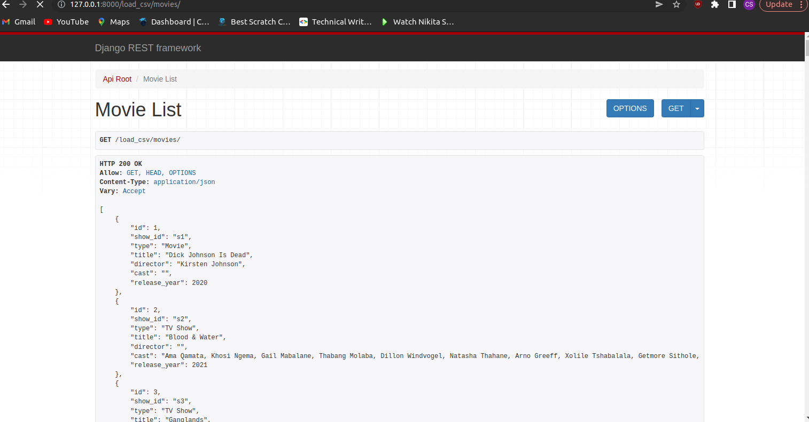
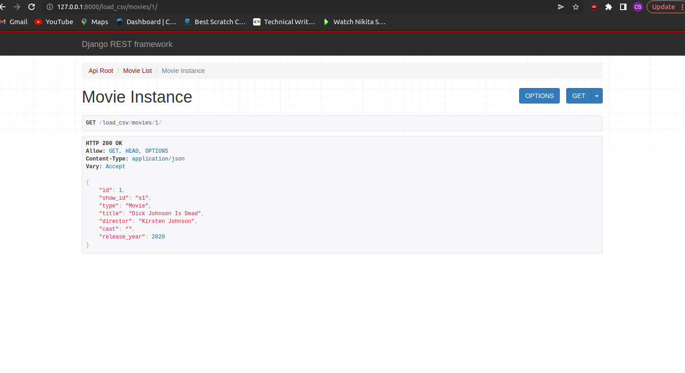

# Automating csv import to django app
This is a django project that automates importing csv data into the database.The projects also calculates the time take to import the database. The django rest framework has been used to create the API endpoints to list and retrieve the movies.

## Dataset used
The dataset used is from kaggle. Here's the link https://www.kaggle.com/datasets/shivamb/netflix-shows

# Commands to use

## To import the database the command used is : 
```python3 manage.py load_csv /path/to/your/file.csv```

## To run the project the command used is :
```python3 manage.py runserver ```

## To install packages used run

```pip install -r requirements.txt```

# Images of the browsable API

